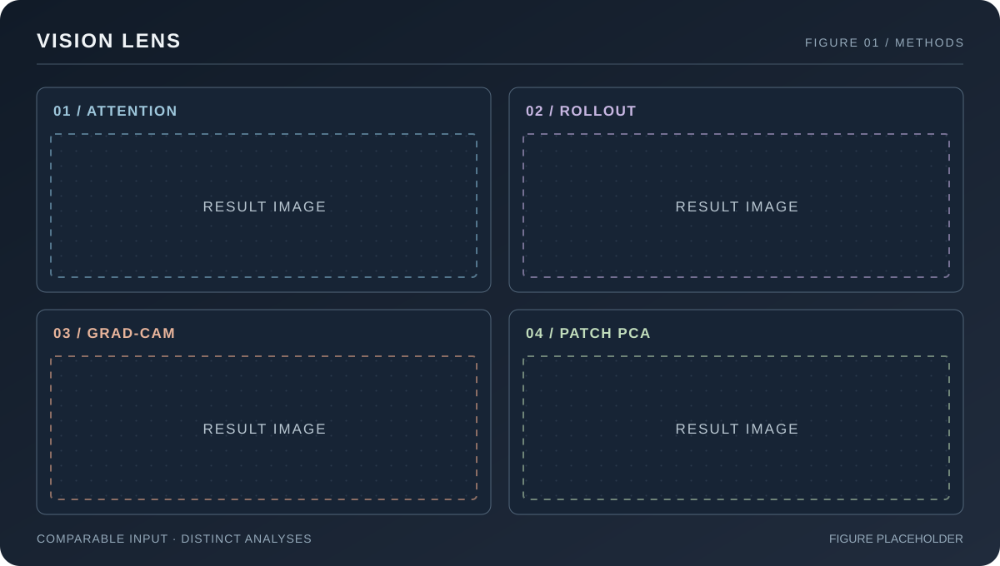
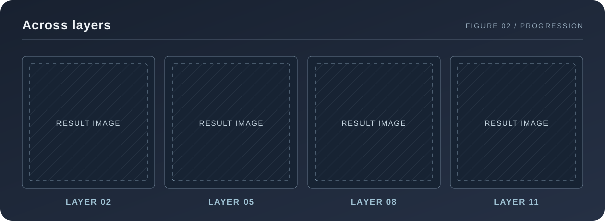
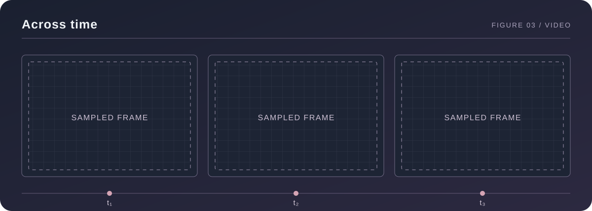

# Vision Lens

[](https://github.com/josedelrey/vision-lens/actions/workflows/ci.yml)

Vision Lens produces visualizations of pretrained vision models for images and sampled video frames. It supports transformer attention, attention rollout, Grad-CAM, and principal component analysis (PCA) of patch features. Runs are defined in YAML and record their resolved settings in a manifest.

## Results



**Figure 1.** Attention, rollout, Grad-CAM, and patch PCA on a common input.



**Figure 2.** Spatial response across selected transformer layers.



**Figure 3.** Sampled frames from a video run, shown at distinct timestamps.

## Methods

| Method | Output | Model family |
|---|---|---|
| Attention | Spatial maps from selected transformer layers and heads | Vision Transformer via `timm` |
| Rollout | Attention propagated through successive transformer layers | Vision Transformer via `timm` |
| Grad-CAM | Class-specific activation maps | CNN via `torchvision` |
| Patch PCA | RGB projection of patch embeddings, with optional image foreground selection | Vision Transformer via `timm` |

These are diagnostic representations of model behavior. Attention and Grad-CAM maps do not establish causal explanations; PCA colors represent feature variation rather than semantic classes.

## Install

Vision Lens supports Linux and Python 3.12 or newer. With [uv](https://docs.astral.sh/uv/) installed, create the locked environment from the repository root:

```bash
uv sync --locked
```

For video decoding and export, include the optional dependency:

```bash
uv sync --locked --extra video
```

Pretrained weights are downloaded on first use. AnyUp interpolation also downloads its model and checkpoint on first use.

## Run

Run an image workflow:

```bash
uv run vision-lens run --config configs/vit_attention.yaml --set input.limit=1
```

Run a video workflow after setting `input.files` to an existing video path in its configuration:

```bash
uv run vision-lens run --config configs/vit_attention.video.yaml
```

Validate settings without loading a model, or inspect all resolved values before a run:

```bash
uv run vision-lens validate --config configs/vit_attention.yaml
uv run vision-lens resolve --config configs/vit_attention.yaml
```

`--set section.key=value` overrides a setting using YAML value syntax and can be repeated. For example, `--set runtime.batch_size=2` changes the inference batch size. See the [configuration reference](docs/configuration.md) for available settings and workflow constraints.

### Configuration

A minimal image workflow selects inputs, a model, an analysis, and an output directory:

```yaml
input:
  files: [examples/1.jpg]

model:
  architecture: vit
  backend: timm
  name: vit_small_patch8_224.dino

preprocessing:
  image_size: 224

analysis:
  method: attention
  layers: [11]

output:
  directory: outputs/attention
```

The configurations in [`configs/`](configs/) cover all four methods and their video variants. Image inputs can be listed explicitly or selected from folders. A `video` section enables timestamp-based frame sampling. Relative paths in a configuration resolve from the nearest project root containing `pyproject.toml`, or from the working directory when no project root is found.

### Outputs

Depending on the workflow, Vision Lens writes heatmaps or PCA color maps, overlays, comparison grids, MP4 streams, and optional raw arrays. Each completed image or single-video run writes `run-manifest.json` with resolved settings, model and runtime details, input metadata, and output paths. Multiple videos produce separate subdirectories and manifests.

Grid layout, output resolution, interpolation, colormap, normalization, and overwrite behavior are configurable. The [configuration reference](docs/configuration.md) documents their defaults and compatibility rules.

## Python API

```python
from vision_lens import load_config, run_pipeline_from_config

config = load_config("configs/vit_attention.yaml")
result = run_pipeline_from_config(config, show_progress=False)

for path in result.output_paths:
    print(path)
```

The public API also provides `run_pipeline(path)`, `parse_config`, `validate_config`, and `resolved_config_yaml`. Results expose the resolved `config` and generated `output_paths`. Configuration failures raise `ConfigurationError`; execution failures raise `PipelineError`. Both inherit from `VisionLensError`.

## License and attribution

Vision Lens is available under the [MIT License](LICENSE). Sources for bundled [images](examples/ATTRIBUTION.md) and [video assets](assets/video-attribution.md) are documented separately.
