# Vision Lens

[](https://github.com/josedelrey/vision-lens/actions/workflows/ci.yml)

Vision Lens visualizes pretrained vision models on images and sampled video frames. It supports transformer attention, attention rollout, Grad-CAM, and principal component analysis (PCA) of patch features. YAML configurations make runs reproducible, and each run records its resolved settings in a manifest.

## Results

<table border="0" cellspacing="0" style="border: 0; border-collapse: collapse;">
  <thead>
    <tr style="background: transparent; border: 0;">
      <th align="center" style="border: 0;">Interpolation</th>
      <th style="border: 0;"><div align="center">Horse 5</div></th>
      <th style="border: 0;"><div align="center">Horse 6</div></th>
    </tr>
  </thead>
  <tbody>
    <tr style="background: transparent; border: 0;">
      <th align="center" style="border: 0;">Original</th>
      <td align="center" style="border: 0;">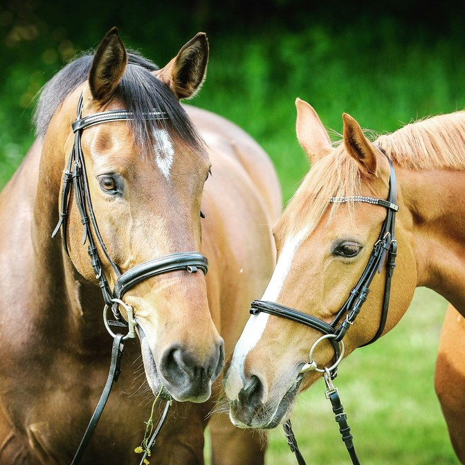</td>
      <td align="center" style="border: 0;">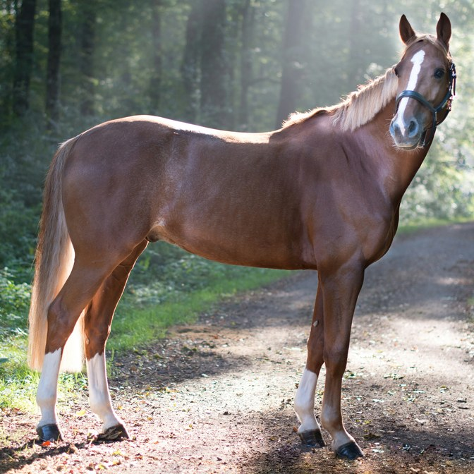</td>
    </tr>
    <tr style="background: transparent; border: 0;">
      <th align="center" style="border: 0;">Bilinear mask</th>
      <td align="center" style="border: 0;"></td>
      <td align="center" style="border: 0;">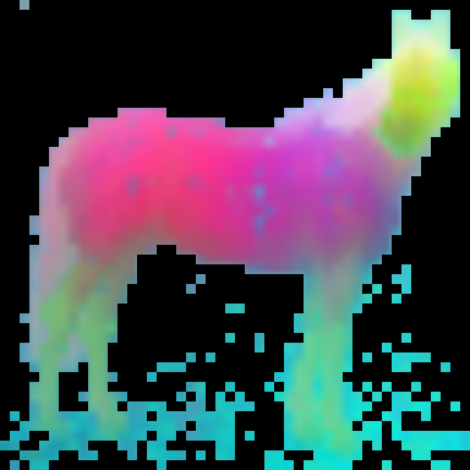</td>
    </tr>
    <tr style="background: transparent; border: 0;">
      <th align="center" style="border: 0;">Nearest</th>
      <td align="center" style="border: 0;"></td>
      <td align="center" style="border: 0;"></td>
    </tr>
    <tr style="background: transparent; border: 0;">
      <th align="center" style="border: 0;">AnyUp soft mask</th>
      <td align="center" style="border: 0;"></td>
      <td align="center" style="border: 0;"></td>
    </tr>
  </tbody>
</table>

**Figure 1.** Patch PCA of two horse images across the selected interpolation modes.

<table border="0" cellspacing="0" style="border: 0; border-collapse: collapse;">
  <thead>
    <tr style="background: transparent; border: 0;">
      <th style="border: 0;"><div align="center">Example</div></th>
      <th style="border: 0;"><div align="center">Original</div></th>
      <th style="border: 0;"><div align="center">Layer 2</div></th>
      <th style="border: 0;"><div align="center">Layer 5</div></th>
      <th style="border: 0;"><div align="center">Layer 8</div></th>
      <th style="border: 0;"><div align="center">Layer 11</div></th>
    </tr>
  </thead>
  <tbody>
    <tr style="background: transparent; border: 0;">
      <th style="border: 0;"><div align="center">1</div></th>
      <td align="center" style="border: 0;"></td>
      <td align="center" style="border: 0;"></td>
      <td align="center" style="border: 0;"></td>
      <td align="center" style="border: 0;"></td>
      <td align="center" style="border: 0;"></td>
    </tr>
    <tr style="background: transparent; border: 0;">
      <th style="border: 0;"><div align="center">2</div></th>
      <td align="center" style="border: 0;"></td>
      <td align="center" style="border: 0;">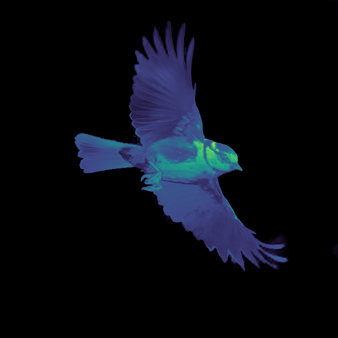</td>
      <td align="center" style="border: 0;"></td>
      <td align="center" style="border: 0;">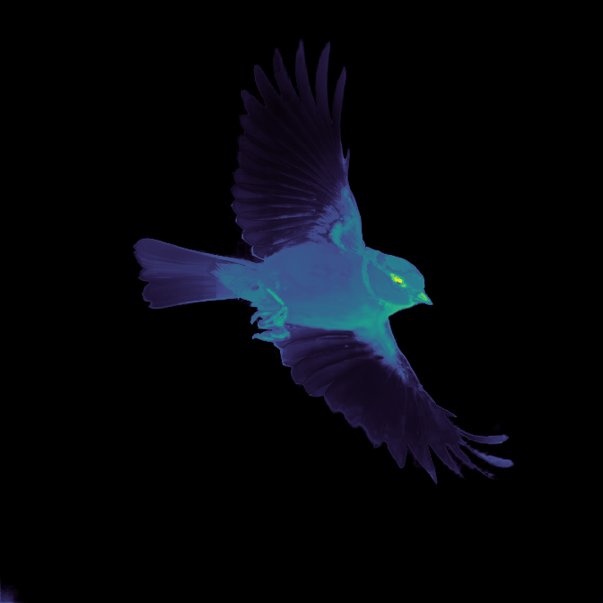</td>
      <td align="center" style="border: 0;">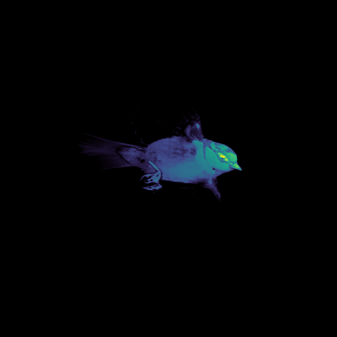</td>
    </tr>
    <tr style="background: transparent; border: 0;">
      <th style="border: 0;"><div align="center">3</div></th>
      <td align="center" style="border: 0;"></td>
      <td align="center" style="border: 0;">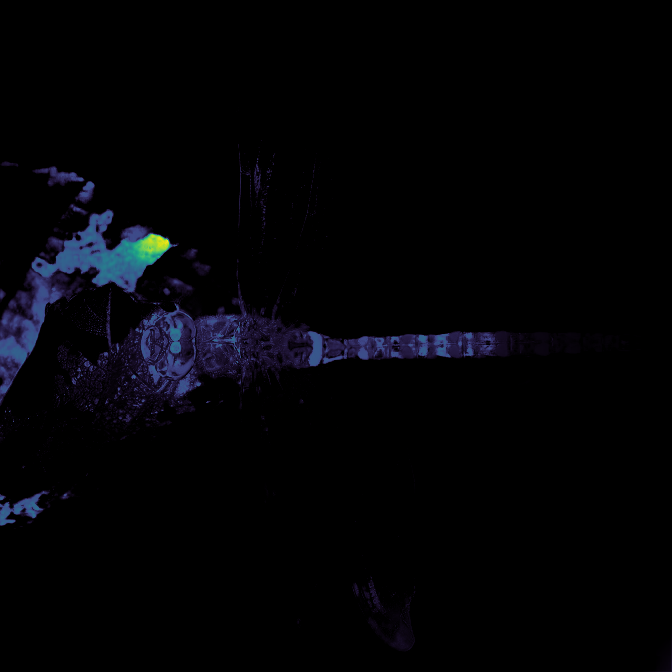</td>
      <td align="center" style="border: 0;"></td>
      <td align="center" style="border: 0;">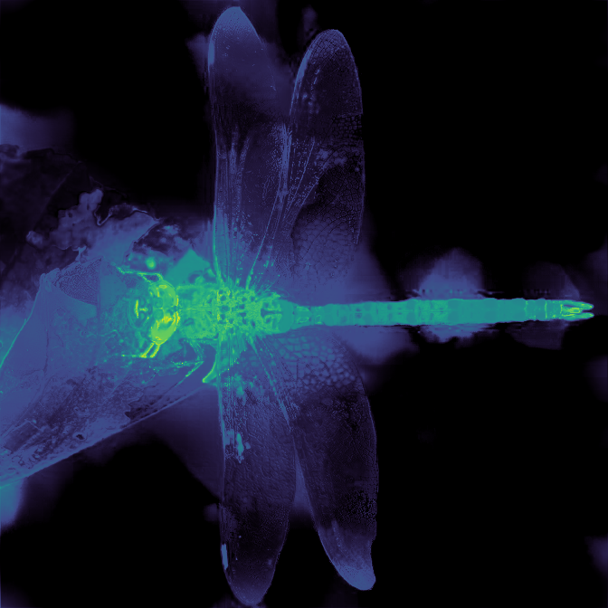</td>
      <td align="center" style="border: 0;">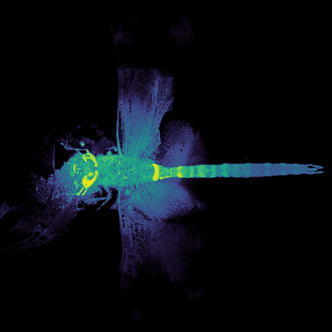</td>
    </tr>
    <tr style="background: transparent; border: 0;">
      <th style="border: 0;"><div align="center">4</div></th>
      <td align="center" style="border: 0;"></td>
      <td align="center" style="border: 0;"></td>
      <td align="center" style="border: 0;"></td>
      <td align="center" style="border: 0;"></td>
      <td align="center" style="border: 0;"></td>
    </tr>
    <tr style="background: transparent; border: 0;">
      <th style="border: 0;"><div align="center">5</div></th>
      <td align="center" style="border: 0;"></td>
      <td align="center" style="border: 0;"></td>
      <td align="center" style="border: 0;"></td>
      <td align="center" style="border: 0;"></td>
      <td align="center" style="border: 0;"></td>
    </tr>
    <tr style="background: transparent; border: 0;">
      <th style="border: 0;"><div align="center">6</div></th>
      <td align="center" style="border: 0;"></td>
      <td align="center" style="border: 0;"></td>
      <td align="center" style="border: 0;"></td>
      <td align="center" style="border: 0;"></td>
      <td align="center" style="border: 0;"></td>
    </tr>
    <tr style="background: transparent; border: 0;">
      <th style="border: 0;"><div align="center">7</div></th>
      <td align="center" style="border: 0;">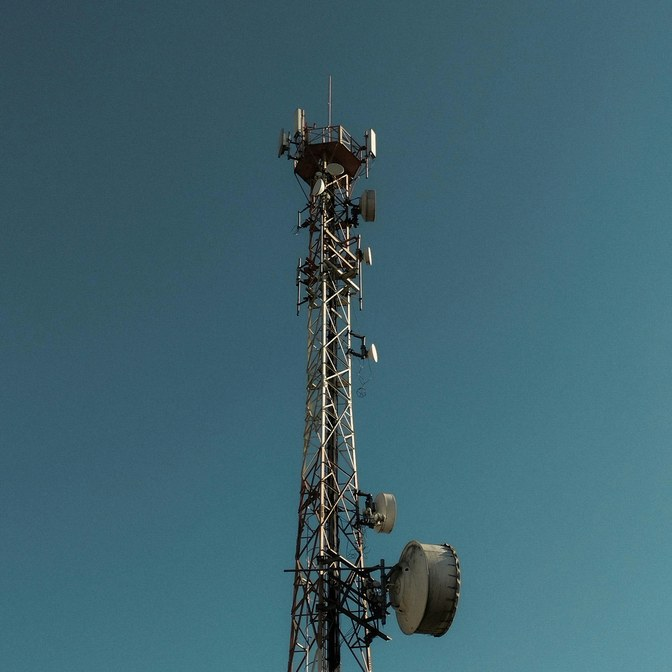</td>
      <td align="center" style="border: 0;"></td>
      <td align="center" style="border: 0;"></td>
      <td align="center" style="border: 0;"></td>
      <td align="center" style="border: 0;"></td>
    </tr>
    <tr style="background: transparent; border: 0;">
      <th style="border: 0;"><div align="center">8</div></th>
      <td align="center" style="border: 0;"></td>
      <td align="center" style="border: 0;"></td>
      <td align="center" style="border: 0;"></td>
      <td align="center" style="border: 0;"></td>
      <td align="center" style="border: 0;"></td>
    </tr>
  </tbody>
</table>

**Figure 2.** Mean-head attention heatmaps from layers 2, 5, 8, and 11 of DINOv2 ViT-S/14 with registers, rendered with AnyUp.

<table border="0" cellspacing="0" style="border: 0; border-collapse: collapse;">
  <thead>
    <tr style="background: transparent; border: 0;">
      <th style="border: 0;"><div align="center">Layer 2</div></th>
      <th style="border: 0;"><div align="center">Layer 5</div></th>
      <th style="border: 0;"><div align="center">Layer 8</div></th>
      <th style="border: 0;"><div align="center">Layer 11</div></th>
    </tr>
  </thead>
  <tbody>
    <tr style="background: transparent; border: 0;">
      <td align="center" style="border: 0;"></td>
      <td align="center" style="border: 0;"></td>
      <td align="center" style="border: 0;"></td>
      <td align="center" style="border: 0;">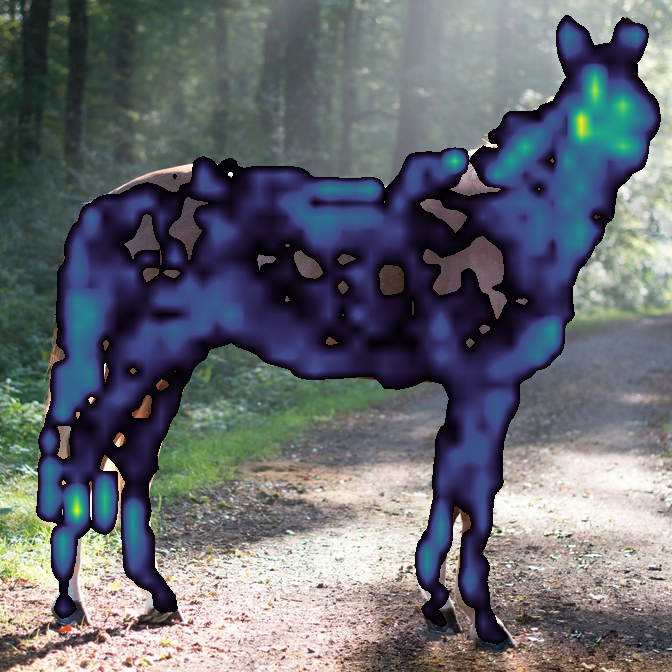</td>
    </tr>
  </tbody>
</table>

**Figure 3.** Mean-head attention overlays for example 6 at layers 2, 5, 8, and 11 of DINOv2 ViT-S/14 with registers, rendered with bilinear interpolation.

## Methods

| Method | Output | Model family |
|---|---|---|
| Attention | Spatial maps from selected transformer layers and heads | Vision Transformer via `timm` |
| Rollout | Attention propagated through successive transformer layers | Vision Transformer via `timm` |
| Grad-CAM | Class-specific activation maps | CNN via `torchvision` |
| Patch PCA | RGB projection of patch embeddings, with optional image foreground selection | Vision Transformer via `timm` |

These outputs are diagnostic views of model behavior, not causal explanations. PCA colors show feature variation rather than semantic classes.

## Install

Vision Lens is distributed from this repository and supports Linux with Python
3.12 or newer. With [Git](https://git-scm.com/) and
[uv](https://docs.astral.sh/uv/) installed, clone the repository and create its
locked environment:

```bash
git clone https://github.com/josedelrey/vision-lens.git
cd vision-lens
uv sync --locked
```

Use `uv sync --locked --extra video` instead when video decoding or export is needed. Pretrained weights are downloaded on first use; AnyUp interpolation also downloads its model and checkpoint.

## Run

Run an image workflow from the repository root:

```bash
uv run vision-lens run --config configs/attention.dino_vits8.yaml --set input.limit=1
```

Runs use a YAML configuration plus optional `--set section.key=value` overrides. The CLI also provides `validate` to check a configuration without loading a model and `resolve` to print all resolved settings. See the [configuration reference](docs/configuration.md) for every setting and compatibility rule.

To process a video, point `input.files` to it and add a `video` section:

```yaml
input:
  files: [/path/to/your/video.mp4]

video:
  sampling_rate: auto
```

Standard video outputs are silent MP4 files. Transparent overlays can also be exported as ProRes 4444 MOV or VP9 WebM files; the [video reference](docs/configuration.md#video) covers sampling and encoding.

### Configuration

A minimal image configuration selects an input, model, analysis, and output directory:

```yaml
input:
  files: [examples/1.jpg]

model:
  architecture: vit
  backend: timm
  name: vit_small_patch8_224.dino

preprocessing:
  image_size: 224

analysis:
  method: attention
  layers: [11]

output:
  directory: outputs/attention
```

The examples in [`configs/`](configs/) cover all four methods. Inputs may be explicit files or files selected from folders. A `video` section enables timestamp-based frame sampling. Relative paths resolve from the nearest project root containing `pyproject.toml`, falling back to the working directory.

### Outputs

Depending on the workflow, Vision Lens writes heatmaps or PCA color maps, flattened or transparent overlays, comparison grids, video streams, and optional raw arrays. Each completed image or single-video run writes `run-manifest.json` with its configuration, model and runtime details, inputs, and output paths. Multiple videos receive separate directories and manifests.

Grid layout, output size, interpolation, colormap, normalization, and overwrite behavior are configurable.

## Python API

```python
from vision_lens import load_config, run_pipeline_from_config

config = load_config("configs/attention.dino_vits8.yaml")
result = run_pipeline_from_config(config, show_progress=False)

for path in result.output_paths:
    print(path)
```

The public API also includes `run_pipeline`, `parse_config`, `validate_config`, and `resolved_config_yaml`. Results expose the resolved configuration and generated output paths. Configuration and execution failures raise `ConfigurationError` and `PipelineError`, both derived from `VisionLensError`.

## License and attribution

Vision Lens is available under the [MIT License](LICENSE). Sources for bundled [images](examples/ATTRIBUTION.md) are documented separately.
