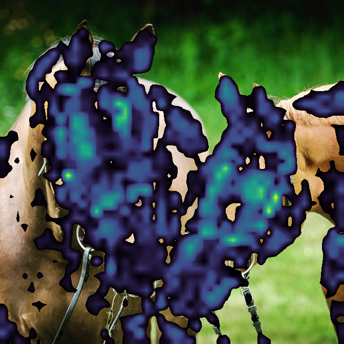

# Vision Lens

[](https://github.com/josedelrey/vision-lens/actions/workflows/ci.yml)
[](https://www.python.org/)
[](https://pytorch.org/)
[](LICENSE)

Vision Lens renders diagnostic views of pretrained vision models for images and
video. It supports transformer attention, attention rollout, Grad-CAM, and PCA
of patch embeddings. Runs are configured through validated YAML or CLI settings.

## What it does

| Method | Result | Models |
|---|---|---|
| Attention | Per-layer, per-head, or fused spatial maps | Vision Transformers through `timm` |
| Rollout | Attention propagated through successive transformer blocks | Vision Transformers through `timm` |
| Grad-CAM | Class-specific activation maps | CNNs through `torchvision` |
| Patch PCA | RGB projections of patch embeddings, with optional foreground selection | Vision Transformers through `timm` |

- Processes images, videos, or mixed folders automatically.
- Writes heatmaps, overlays, grids, raw arrays, and silent video streams.
- Supports shared/fixed normalization and nearest, bilinear, or AnyUp feature
  interpolation.
- Saves a `run-manifest.json` with resolved settings, model metadata, inputs,
  outputs, package versions, and run times.

These visualizations are diagnostic views, not causal explanations. PCA colors
show feature variation, not semantic classes.

## Results

| Example | Patch PCA | Layer 11 attention overlay |
|:---|:---:|:---:|
| Horse 5 |  |  |
| Horse 6 |  |  |

## Requirements

- Linux
- Python 3.12 or newer
- [Git](https://git-scm.com/)
- [uv](https://docs.astral.sh/uv/)

## Install

Clone the repository and create its locked environment:

```bash
git clone https://github.com/josedelrey/vision-lens.git
cd vision-lens
uv sync --locked
```

For video decoding and export, include the optional video dependency:

```bash
uv sync --locked --extra video
```

Pretrained weights are downloaded on first use. AnyUp interpolation also
downloads model code from a pinned AnyUp revision and its pretrained checkpoint.

## Quick start

Run one bundled attention example:

```bash
uv run vision-lens run \
  --config configs/attention.dino_vits8.yaml \
  --input-limit 1
```

The example writes its artifacts and `run-manifest.json` under
`outputs/image/dino_vits8/attention/`.

Validate a configuration without loading a model, or inspect its fully resolved
form:

```bash
uv run vision-lens validate --config configs/attention.dino_vits8.yaml
uv run vision-lens resolve --config configs/attention.dino_vits8.yaml
```

## Configuration

A minimal image workflow looks like this:

```yaml
input:
  files: [examples/1.jpg]

model:
  architecture: vit
  backend: timm
  name: vit_small_patch8_224.dino

preprocessing:
  image_size: 224

analysis:
  method: attention
  layers: [11]

output:
  directory: outputs/attention
```

Save it as `workflow.yaml`, then run:

```bash
uv run vision-lens run --config workflow.yaml
```

Every setting is also available as a `--section-key` flag. CLI values are YAML,
so lists and mappings should normally be quoted:

```bash
uv run vision-lens run \
  --input-files '[examples/1.jpg]' \
  --model-architecture vit \
  --model-backend timm \
  --model-name vit_small_patch8_224.dino \
  --preprocessing-image-size 224 \
  --analysis-method attention \
  --analysis-layers '[11]' \
  --output-directory outputs/attention
```

You can combine a YAML file with repeatable `--set section.key=value` overrides
or named flags. Precedence is: YAML, then `--set`, then named flags.

The bundled [`configs/`](configs/) cover all four methods. The complete setting
reference, defaults, compatibility rules, and path-resolution behavior are in
[`docs/configuration.md`](docs/configuration.md).

## Images and video

Supported image formats are JPEG, PNG, and WebP. Supported video containers are
AVI, M4V, MKV, MOV, MP4, and WebM. Extensions are matched case-insensitively;
Pillow and PyAV perform the actual decoding.

Folders may contain images, videos, or both:

```yaml
input:
  folders: [/path/to/media]
  recursive: true
```

Media types are detected automatically. A `video` section is only needed to
override video defaults:

```yaml
video:
  sampling_rate: 2.5
  frame_limit: 100
```

Video outputs are silent. Ordinary heatmaps and flattened overlays are MP4;
transparent overlays can be ProRes 4444 MOV or VP9 WebM. Source audio is not
copied.

## Outputs

Depending on the workflow, Vision Lens can write:

- heatmaps or PCA color maps;
- flattened and transparent overlays;
- paginated comparison grids;
- raw NumPy arrays;
- fitted PCA projections; and
- rendered video streams.

### Attention across layers

Images 2 and 3 from the AnyUp DINOv2 ViT-S/14 run show how mean-head attention
changes across transformer depth:

| Example | Layer 2 | Layer 5 | Layer 8 | Layer 11 |
|:---|:---:|:---:|:---:|:---:|
| Image 2 |  |  |  |  |
| Image 3 |  |  |  |  |

Image-only runs write directly to `output.directory`. A single video does the
same. Multiple videos receive separate source-named subdirectories. Mixed runs
use this layout:

```text
output.directory/
├── images/
│   ├── ...
│   └── run-manifest.json
└── videos/
    └── <video-name>/
        ├── ...
        └── run-manifest.json
```

The default overwrite policy is `error`; use `replace` or `skip` explicitly when
rerunning into an existing output directory.

## Python API

```python
from vision_lens import load_config, run_pipeline_from_config

config = load_config("configs/attention.dino_vits8.yaml")
result = run_pipeline_from_config(config, show_progress=False)

for path in result.output_paths:
    print(path)
```

The public API also exposes `run_pipeline`, `parse_config`, `validate_config`,
`config_to_dict`, and `resolved_config_yaml`. Configuration and execution errors
derive from `VisionLensError`.

## Development

Install all optional and development dependencies, then run the same checks as
CI:

```bash
uv sync --locked --all-extras
uv run ruff check vision_lens tests
uv run ruff format --check vision_lens tests
uv run pytest -m "not real_model"
```

Real-model smoke tests download pretrained weights and are opt-in:

```bash
VISION_LENS_RUN_REAL_MODELS=1 \
  uv run pytest tests/test_real_models.py -m real_model
```

## License and attribution

Vision Lens is available under the [MIT License](LICENSE). Sources for the
bundled [example images](examples/ATTRIBUTION.md) are documented separately.
